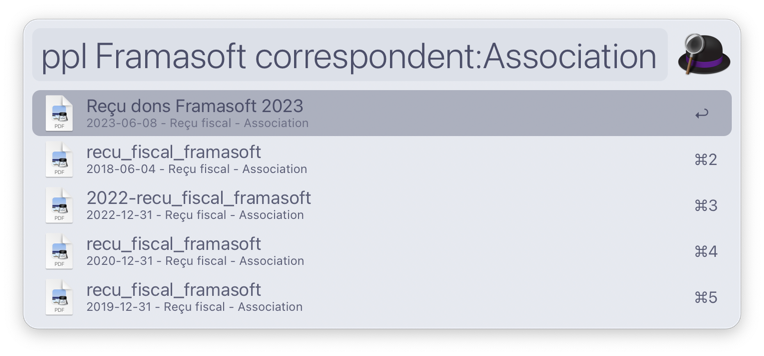
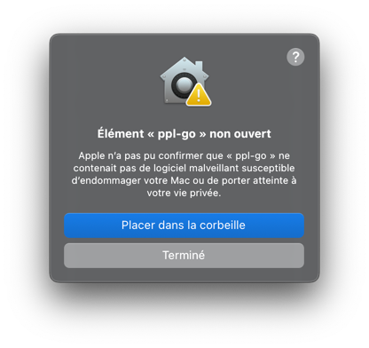

# paperless-alfred-go

`paperless-alfred-go` is a workflow for searching paperless documents via Alfred and opening them in your browser.

The workflow fully supports the French alphabet, including accents. I suppose (without having tested) that it will support other alphabets just fine.

## Usage

The trigger keyword is `ppl` and it expects a document search string ([documentation here](https://docs.paperless-ngx.com/usage/#document-searches)).

If no document is found, the only result opens your search in the web UI so you can continue from there.
You can also trigger this on any file with the `Cmd` modifier.

## Installation

### Pre-compiled (GitHub releases)

The latest version is available on the [GitHub release page](https://github.com/Crocmagnon/paperless-alfred-go/releases).

After installing this workflow, you'll need to run it a first time. macOS will complain that "ppl-go cannot be verified".

**This is expected**, as the code of this workflow is written in Go and compiled into a binary. I don't have $99/year to spend on an Apple Developer account just for this project, so you see this popup.

> [!NOTE]
> It may be the first time you see this warning. Don't panic, I'm not trying to steal your data. I just don't have $99/yr to spend on this.

Apple's instructions on how to bypass this protection are available [here](https://support.apple.com/en-us/guide/mac-help/mh40616/mac).

### From sources

* [Download and install Go](https://go.dev/doc/install) version >= 1.23
* Clone this repository
* `make install` - this will open Alfred to import the workflow
* Configure the workflow in Alfred

## A bit of context

I was looking for a paperless search workflow.

I found the nice [`paperless-alfred`](https://github.com/Naam/paperless-alfred) by Naam.

Unfortunately, this workflow presented several issues for my use case:

* multi-word queries were broken
* queries with French accents were broken

The workflow was also quite complex, downloading files before opening them locally.

I needed something simpler, so I wrote my own.
